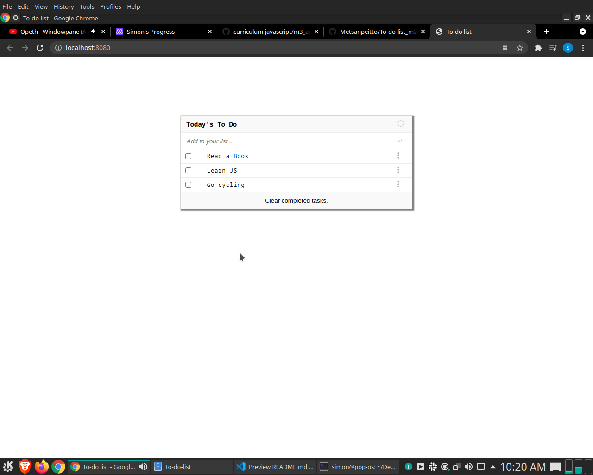

# To-do-list

> This project is simple minimalist to-do-list. You can add new tasks and check one when you finish it, remove the checked and drag and drop
to reorder the tasks.

Additional description about the project and its features.

## Built With
    HTML
    CSS
    JS

## Live Demo

[Live Demo Link](https://flamboyant-khorana-e25906.netlify.app)

## Getting Started

### Prerequisites
  **webpack**,
  **HtmlWebpackPlugin**,
  **style-loader css-loader**,
  **webpack-dev-server**

## Setup

#### $git clone https://github.com/SimonGrchevski/to-do-list.git
#### $cd to-do-list
#### $npm run build
#### $npm start

## Authors

👤 **Author1**

- GitHub: [Github](https://github.com/SimonGrchevski)
- LinkedIn: [LinkedIn](https://www.linkedin.com/in/simon-grchevski-682935209/)
- Twitter: [Twitter](https://twitter.com/grchevski)

## 🤝 Contributing

Contributions, issues, and feature requests are welcome!

Feel free to check the [issues page](../../issues/).

## Show your support

Give a ⭐️ if you like this project!

## Acknowledgments

- Hat tip to anyone whose code was used
- Inspiration
- etc

## 📝 License

This project is [MIT](./MIT.md) licensed.

